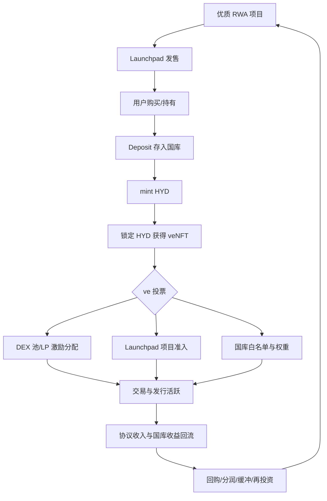
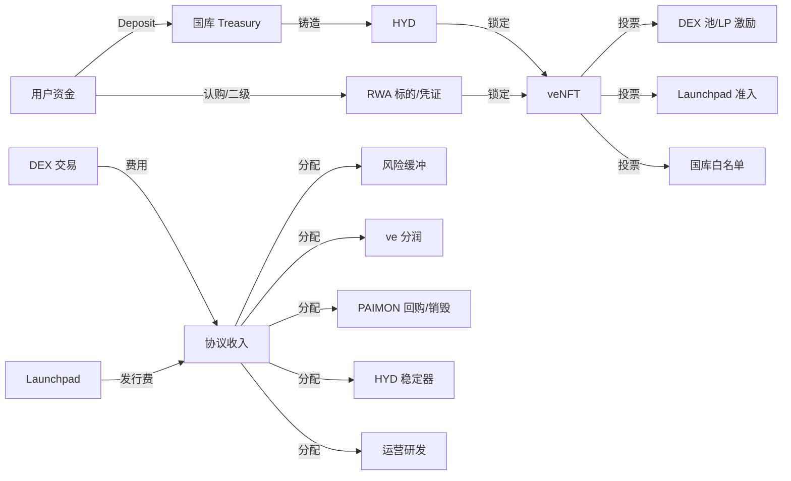
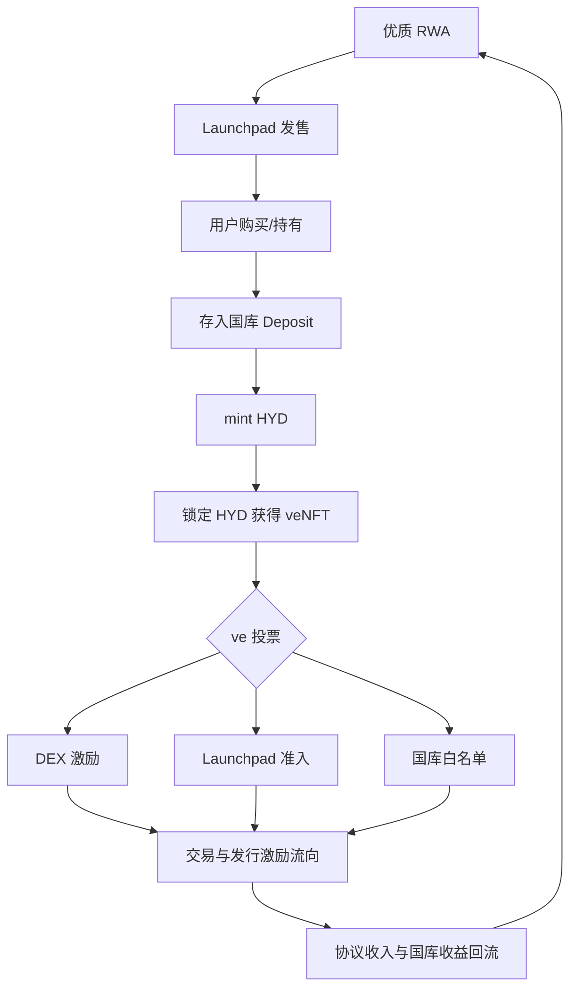
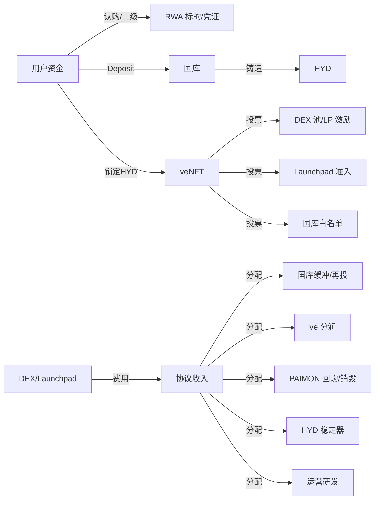
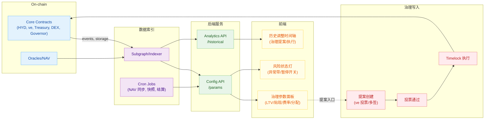

> 面向 RWA 的发行、流动性与治理一体化协议：Launchpad + ve33 DEX + 国库 + HYD 收益合成资产
> 

---

### 1. 产品概览

- 产品定位：面向真实世界资产（RWA）的流动性与发行协议，集成 Launchpad、ve33 机制的 DEX、以及基于国库的收益型合成资产 HYD。
- 核心目标：
    - 让用户以更低门槛、更高资本效率参与 RWA。
    - 用 ve 机制治理 Launchpad 上币与国库资产准入，形成“收益—治理—流动性—增长”的飞轮。
- 协议代币：
    - HYD：非稳定币，但波动性低于典型波动资产。由国库支持，通过存入 RWA 资产 mint。
    - PAIMON：平台代币，用于生态激励、费用捕获、治理配套等。

---

### 2. 系统组件

- Launchpad：合规与风控筛选后的 RWA 项目发行平台。用户可在此购买 RWA 资产或其代币化凭证。
- ve33 DEX：内置 ve 模型的去中心化交易场所，支持投票激励、流动性引导、费用分配。
- 国库（Treasury）：接收 RWA 资产或其凭证的抵押与收入，作为 HYD 的支持与收益来源。
- HYD 合成资产：用户存入 RWA 到国库后，按一定折价/铸造率 mint 出 HYD。
- veNFT（锁定 HYD 后获得）：承载治理权与激励权，可参与：
    - 交易对激励投票（ve33 风格）。
    - Launchpad 项目准入投票（决定哪些资产上线）。
    - 国库池资产白名单投票（决定哪些资产进入支持 HYD 的底池）。

---

### 3. 协议飞轮（高层逻辑）

1. 优质 RWA 通过 Launchpad 发售，吸引资金进入。
2. 用户将 RWA Deposit 至国库，mint 出 HYD。
3. 用户锁定 HYD 获得 veNFT，参与治理投票，决定激励流向与资产准入。
4. 投票引导的流动性与激励提升交易与二级需求，促进更多 RWA 上线与收入回流国库。
5. 国库收益反哺 HYD 预期与生态激励，强化再循环。

---

### 4. 关键流程

- 发行与购买（Launchpad 或 DEX）：
    - 用户通过 Launchpad 或 DEX 购入 RWA 资产或其代币化凭证。
- 存入与铸造（Deposit → mint HYD）：
    - 将 RWA 抵押至国库，按铸造率获得 HYD。
    - 设定安全边际与 LTV、清算或赎回规则，保证国库稳健。
- 锁定与治理（lock HYD → veNFT）：
    - 锁定周期与权重曲线（如线性衰减）决定治理权重。
    - ve 投票场景：
        - 交易对激励分配（ve33）。
        - Launchpad 项目准入与配额倾斜。
        - 国库池资产白名单与权重。
- 费用与激励：
    - 交易费、发行费、赎回费部分回流国库。
    - 按投票结果将激励（HYD、PAIMON 或费用分红）分配至目标池。
- 风险与稳定：
    - 通过质押物质量、贴现系数、LTV、清算与回购策略维持 HYD 与国库的稳健耦合。
    - 可引入保险缓冲金与紧急暂停机制。

---

### 5. 代币经济与参数建议

- HYD（收益合成资产）
    - 价值锚定：由国库资产与其产生的收益支撑，目标是“稳于波动资产”。
    - 铸造率与贴现：根据 RWA 风险分层设定铸造率；安全资产高，流动性或波动较差资产低。
    - 费用：铸造/赎回费小幅收取；协议可参与回购与流动性补贴。
- PAIMON（平台代币）
    - 用途：生态激励、手续费回扣、活动白名单、治理补充。
    - 排放：与 ve 投票和真实交易活跃挂钩，避免“空转挖矿”。
    - 回购与销毁：用协议收入部分回购 PAIMON，提升价值捕获。
- veNFT
    - 锁仓区间：1 周—4 年，最长锁定权重最高。
    - 权重设计：线性或凸性曲线，鼓励长锁与积极治理。
    - 分润来源：交易费、发行费、国库收益分配的部分比例。

> 注：具体参数如 LTV、清算折扣、铸造费率、锁仓曲线、收益分配比例，将在合规与风控评估后落表。
> 

---

### 6. 治理与合规

- 准入治理：Launchpad 与国库池白名单需通过 veNFT 投票通过。
- 信息披露：RWA 基础信息、估值方法、现金流来源、审计与托管安排需透明可核验。
- 风控框架：
    - 资产分层与限额
    - 动态贴现因子与风险溢价
    - 清算与回撤机制
    - 多签与预言机冗余

---

### 7. 收费项与收入分配（样例框架）

- 收入来源：交易费、发行费、赎回费、国库收益、附加服务费。
- 分配路径：
    - 国库再投资与风险缓冲
    - ve 投票池激励
    - HYD 与 PAIMON 的回购与销毁预算
    - 研发与运营基金

---

### 8. 路线图（示例）

- 阶段 1：NFT 预售与社区冷启动，DEX 核心模块上线。
- 阶段 2：首批 RWA 项目 Launchpad，上线存入与铸造 HYD。
- 阶段 3：完善治理、白名单、清算与风险缓冲机制，扩大资产谱系。
- 阶段 4：多链扩展与跨境合规桥接，机构侧工具集成。

---

### 9. 可视化

### 9.1 协议飞轮与资金流向图（示意）

- 飞轮逻辑（抽象）：

- 资金与价值流（方向与主体）：

---

### 10.1 风控白名单草案（资产分层）

<aside>
🛡️

白名单采用分层+限额的组合策略，动态贴现和 LTV 在治理下调整。

</aside>

| 层级 | 示例资产 | LTV 上限 | 铸造记账折价 | 单资产限额 | 总池占比上限 | 喂价/估值 | 披露频率 |
| --- | --- | --- | --- | --- | --- | --- | --- |
| T1 | 美/欧短久期主权债、货币基金份额、投研评级最高的托管票据 | 80% | -2% | 1000 万 USDC 当量 | 60% | 链上预言机+托管 NAV 周频同步 | 周报+月度审计摘要 |
| T2 | 投资级信贷、优质真实收益池（短期保理、机票/应收） | 65% | -5% | 700 万 USDC 当量 | 30% | 多源喂价+独立估值报告 | 双周披露+季度审计 |
| T3 | 地产/新兴类、流动性一般且波动较高的 RWA | 50% | -8% | 300 万 USDC 当量 | 10% | 独立估值+保守折价 | 双周披露+事件驱动更新 |
- 触发器与保护：
    - 价格异常带：±3% 启动缓冲，±5% 暂停+治理复核。
    - 单资产穿透：任一资产触发连续 2 次异常，自动下调 LTV 5pct 并提高折价 2pct。
    - 风险缓冲：协议收入 25% 用于缓冲与再投资，确保 HYD 偿付能力。

---

### 10.2 参数面板（落地填空版）

### 10.3 治理参数读数面板（数据流架构 · Mermaid）

> 说明：前端面板读取 Config API 的实时参数与历史序列；用户从面板入口发起治理提案，流经投票与时间锁后回写到链上合约，随后被 Indexer 捕获并刷新前端。
> 
- Launchpad 费用：发行费 1.0%（其中 70% 入国库，30% 入 ve 分润池）
- DEX 现货费率：0.25%（70% 分润，30% 国库）
- HYD 铸造/赎回费：0.30% / 0.50%
- 清算阈值与罚金：115% / 5%
- ve 分润门槛：锁≥3 个月
- 收入分配：40% ve 激励 / 25% 缓冲 / 20% 回购 PAIMON / 10% HYD 稳定器 / 5% 运营

> 参数面板可拆成前端 Config 卡片，支持后端读取治理参数并动态展示历史调整。
> 

### 10. 参数表（初始建议值）

- HYD 铸造与赎回
    - 资产分层与铸造率（LTV 上限）：
        - T1（国债、投研评级高、流动性强）：80%
        - T2（投资级信贷、优质真实收益池）：65%
        - T3（地产/新兴类、流动性一般）：50%
    - 安全贴现（铸造记账折价）：
        - T1：-2%
        - T2：-5%
        - T3：-8%
    - 费用：
        - 铸造费：0.30%
        - 赎回费：0.50%
        - 提前赎回（距到期>30天）：+0.30% 附加费
    - 结算与清算：
        - 清算阈值：实际抵押价值 / 债仓价值 < 115%
        - 清算罚金：5%（用于风险缓冲与回购预算）
- veNFT 锁仓与权重
    - 锁仓档位与权重：
        - 1 周：0.05x
        - 1 个月：0.20x
        - 3 个月：0.50x
        - 6 个月：0.75x
        - 12 个月：1.00x
        - 24 个月：1.50x
        - 48 个月：2.00x
    - 权重衰减：线性随时间衰减
    - 分润资格：需≥3 个月锁仓方获得交易费与发行费分润
- 收入分配（协议收入的基准分配）
    - 40%：ve 投票目标池激励（HYD/PAIMON/费分配）
    - 25%：国库风险缓冲与再投资
    - 20%：PAIMON 回购与销毁预算
    - 10%：HYD 回购稳定器（在极端偏离时启用）
    - 5%：运营与研发基金
- DEX 与交易费用
    - 现货交易费：0.25%
    - 其中 70% 进入 ve 分润池，30% 入国库
- 预言机与风控参数
    - 预言机来源：主要链上喂价 + 合规托管 NAV 周频同步
    - 价格异常带：±3% 触发缓冲，±5% 触发暂停与治理复核
    - 紧急暂停：多签触发；24-72 小时内进入治理复核