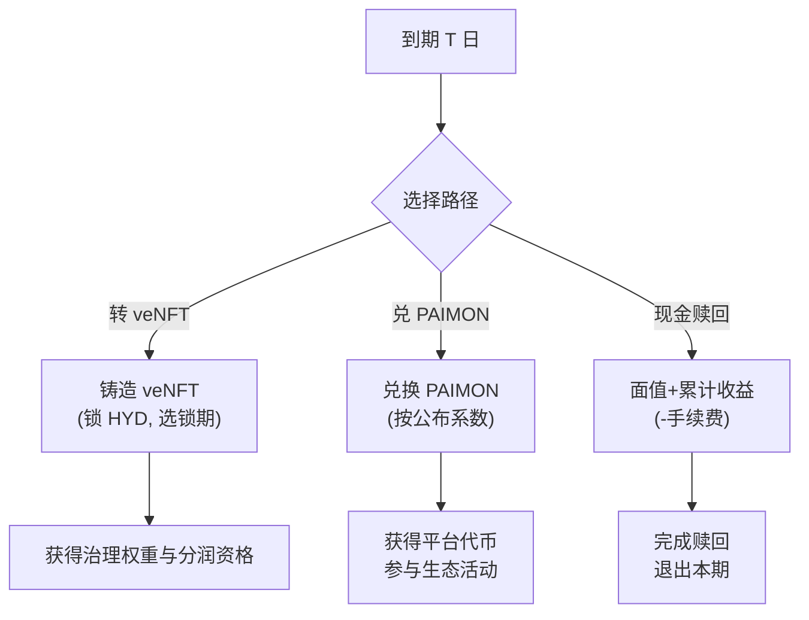
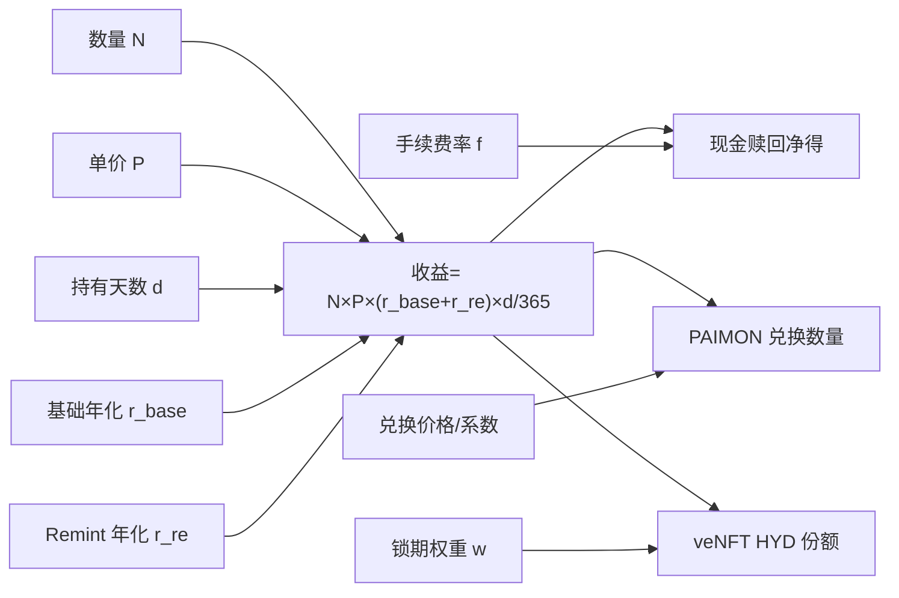

> 3 个月收益债券凭证 + 可转股选项；面向 RWA 协议冷启动与治理引导
> 

---

### 1. 概述

- 名称：RWA 协议预售 NFT（收益债券凭证 + 可转股选项）
- 数量与定价：总量 5,000 枚，单价 100 USDC
- 期限：3 个月（到期提供三选一）
- 收益口径：目标年化中枢 6%，区间年化 2%～10%
    - 3 个月对应名义收益约 0.5%～2.5%

---

### 2. 收益结构

- 基础收益：年化 2%（按持有天数计算，3 个月约 0.5%）
- Remint 浮动收益：年化 0%～8%（3 个月折算 0%～2%）
    - 触发条件：持有人在期间参与 remint 与生态交互，提升自身收益权。
    - 目的：鼓励深度参与，提高资本效率与协议活跃度。

参考示例（单张 100u，持有满 3 个月）：

- 仅基础收益 ≈ 0.5u
- 基础 + Remint 中枢（年化 4%）≈ 1.0u
- 基础 + Remint 上沿（年化 10%）≈ 2.5u

> 实际兑付以链上规则与快照为准。
> 

---

### 3. 到期三大选项（债转股机制）

到期 T 日，三选一：

1) 转为 veNFT（锁定 HYD）

- 兑换：按 HYD 价格 1u = 1 HYD 的“记账价格”计算，面值 + 累计收益 → 等量 HYD 锁仓，铸成 veNFT。
- 权益：获得治理权重与后续分润资格。
- 选项：多档锁期与权重，用户自选。

2) 兑换平台代币（PAIMON）

- 价格：按到期公布的兑换系数执行。
- 用途：生态活动、费用回扣、治理补充。

3) 赎回现金流（销毁 NFT 领取实际收益）

- 规则：销毁 NFT 按面值 + 累计收益直接兑付（扣除必要手续费用）。
- 适用：偏好稳健现金回收的用户。

> 注：执行后 NFT 作废；若到期未操作，可设定宽限期与默认路径。
> 

---

### 4. Remint 机制说明

- 定义：在持有期间将对应收益权或新增资金参与“再铸”（remint）操作，获得额外浮动收益资格。
- 影响：增加收益上限与治理参与深度，同时加速生态资金循环。
- 风险：Remint 会增加市场与流动性敞口，需提示波动风险与清算边界（若有）。

---

### 5. 用户流程

1. 铸造：连接钱包 → 选择数量 → 支付 100u/枚 → 获得 NFT。
2. 持有期：查看累计收益与可用 Remint 选项；可收到里程碑提醒与教程。
3. 到期处理：在到期或宽限期内选择三选一路径并链上执行。
4. 费用：铸造费、兑付费、Gas 按前端明确展示与合约参数执行。

---

### 6. 风险与披露

- 收益不等同承诺：Remint 为浮动区间，不保证上限；RWA 现金流与估值存在现实世界风险。
- 市场风险：PAIMON、HYD 的二级价格波动。
- 合规披露：公开底层 RWA 的托管、估值与审计信息；关键参数与风控事件设置公告与投票流程。

---

### 7. 关键参数区（首发）

### 10. 到期“三选一”对比表（示例）

### 10.1 到期决策流（mermaid）

### 11.1 收益计算关系图（mermaid）

| 路径 | 得到的资产/权益 | 定价基准 | 流动性 | 额外收益来源 | 主要风险 |
| --- | --- | --- | --- | --- | --- |
| 转 veNFT（锁 HYD） | veNFT（治理+分润权） | 记账价 1u = 1 HYD（锁定） | 锁期内不可流动（可选长锁获更高权重） | ve 分润、投票激励、潜在二级溢价 | 锁定流动性风险、HYD 二级价格波动 |
| 兑 PAIMON | PAIMON 代币 | 到期前 24h 公布的兑换系数（参考 30D 均价的 95%） | 高（可二级交易） | 生态活动、费用回扣、潜在代币升值 | PAIMON 二级价格波动、兑换名额上限 |
| 现金赎回 | 面值+累计收益（扣手续费） | 面值与计息规则 | 最高（稳定） | 无 | 机会成本（放弃治理与潜在上行） |

> 默认路径：宽限期结束未操作则默认转 veNFT（锁 3 个月）；如从未锁仓过则默认现金赎回。
> 

---

### 11. 收益计算器示例（100 枚，持有 90 天）

<aside>
🧮

以下为前端交互示例公式，便于实现时直连参数面板。

</aside>

- 输入：
    - 购买数量 N = 100 枚，单价 P = 100u，持有天数 d = 90
    - 基础年化 r_base = 2%
    - Remint 年化 r_re = 0%、4%、8% 三档示例
    - 手续费 f_redeem = 0.30%
- 计算：
    - 基础收益 = N×P×r_base×d/365
    - Remint 收益 = N×P×r_re×d/365（按周快照、可映射积分权重）
    - 到期应得（现金赎回）= N×P + 基础收益 + Remint 收益 − 手续费×(N×P + 收益)
    - 到期应得（兑 PAIMON）= (N×P + 收益) / 兑换价格
    - 到期应得（转 veNFT）= (N×P + 收益) HYD 份额，按锁期获得权重 w
- 示例结果（近似）：
    - 仅基础（r_re=0%）：
        - 收益 ≈ 100×100×2%×90/365 ≈ 49.3u
        - 现金赎回净得 ≈ 10,049.3u − 0.3% ≈ 10,019.1u
    - 中枢（r_re=4%）：
        - 收益 ≈ 49.3u + 98.6u ≈ 147.9u
        - 现金赎回净得 ≈ 10,147.9u − 0.3% ≈ 10,117.5u
    - 上沿（r_re=8%）：
        - 收益 ≈ 49.3u + 197.3u ≈ 246.6u
        - 现金赎回净得 ≈ 10,246.6u − 0.3% ≈ 10,215.9u
- 前端交互建议：
    - 滑杆选择数量与 Remint 强度（或积分权重），实时联动三路径净得对比
    - 一键“模拟锁期”显示 ve 权重与预估分润区间
- 发行量：5,000
- 售价：100u
- 期限：3 个月
- 基础收益：年化 2%
- Remint 浮动收益：年化 0%～8%
- 目标年化中枢：6%
- 到期选项：转 veNFT（锁 HYD）或兑 PAIMON 或销毁赎回
- 手续费：前端与合约参数区展示

---

### 8. 参数表

- 发行与期限
    - 总量：5,000 枚
    - 单价：100 USDC
    - 期限：90 天（以区块时间近似）
    - 宽限期：7 天（未操作默认路径见下）
- 收益与计算
    - 基础收益：年化 2%（T+n 按天计息）
    - Remint 浮动收益：年化 0%～8%，按周快照与积分权重累计
    - 目标年化中枢展示：6%
- 到期三选一路径
    - 转 veNFT（锁 HYD）：
        - 兑换价：记账价 1u = 1 HYD
        - 必选锁期：≥3 个月；支持 3m、6m、12m、24m、48m
        - 锁期权重：与主协议 ve 权重一致
    - 兑 PAIMON：
        - 兑换系数：到期前 24 小时公布；建议以 30 日成交均价的 95% 为参考
        - 兑换上限：每地址可将不超过持有量的 80% 选择此路径，避免单点挤兑
    - 赎回现金流：
        - 规则：面值 + 累计收益 − 手续费
        - 手续费：0.30%
- Remint 规则
    - 资格：持有 NFT 并完成指定交互（如提供 HYD 流动性、参与投票、完成任务）
    - 计量：周度积分制，区间收益上限对应 8% 年化的线性映射
    - 风险提示：在前端明显位置展示“浮动收益不承诺上限”
- 默认路径（宽限期结束未操作）
    - 默认转 veNFT（锁 3 个月）
    - 如用户历史从未锁仓，则默认现金赎回
- 披露与合规
    - 资金用途与底层资产信息披露频率：双周
    - 审计与托管更新：月度
- 前端组件阈值
    - 单地址最大购买量：500 枚
    - 单笔最小购买：1 枚
    - 活动白名单：支持 KYC 名单放行（如适用司法辖区）
- 收益展示：
    - 主卡片：目标年化 6%（区间 2%～10%）
    - 细则：基础 2% 年化 + Remint 0%～8% 年化（3 个月折算 0.5%～2.5%）
- 教程弹层：为什么 Remint 能提高收益、与生态飞轮的关系图解。
- 计算器：输入数量与策略，预估不同路径的到期可得。
- 到期页：三选一按钮并列、实时比较净得。